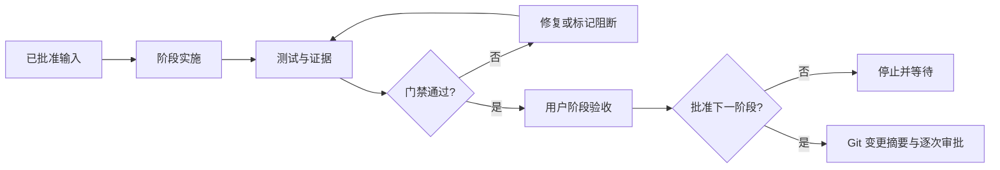

# 教育知识库总体项目流程 V1

> 文档版本：V1.0  
> 日期：2026-09-05  
> 状态：自审完成，待用户审批  
> 权威输入：`项目需求立项/教育/需求说明.md`、`提示词/教育知识库项目流程提示词_v1.1.md`  
> GitHub 目标：`https://github.com/yefeng7331/Shopkeeper_Think_Tank`  
> 当前边界：只完成流程与技术基线文档，不启动 P0、代码、环境、数据库、数据处理、Git 提交或推送

---

## 1. 文档定位与效力

本文档是教育知识库项目后续规划、实施、验收、变更和交接的核心流程基线。阶段任务、技术设计、测试计划和实施提示词不得与本文档冲突。

### 1.1 指令优先级

1. 当前窗口用户最新明确指令。
2. 当前工作区适用的 `AGENTS.md` 和安全红线。
3. 本核心文档及已批准的变更记录。
4. `需求说明.md` 与 V1.1 提示词。
5. 调研报告、参考项目、其他工作窗口和示例。

其他工作窗口的路径、业务内容、技术选择和历史授权不得自动迁移。文档中的“下一步”只描述流程，不构成执行授权。

### 1.2 状态词

| 状态 | 含义 |
|---|---|
| `passed` | 已有可复现证据证明满足验收条件 |
| `failed` | 已执行验证且结果不满足标准 |
| `blocked` | 缺少批准、输入、环境或外部条件，无法继续 |
| `unverified` | 尚未验证或证据不足，不能按通过处理 |

没有证据的“看起来完成”只能标记为 `unverified`。

---

## 2. 项目目标、范围与非目标

### 2.1 项目目标

面向教育培训场景，建立能够接入课程资料、项目文档、教学讲义、题库与题目的智能知识库，为学员、助教和教学运营提供：

- 课程发现、课程介绍和课程详情；
- 课程文档与项目文档检索；
- 题库和题目检索；
- 基于知识库证据的问答与引用；
- 单轮、多轮、流式输出和历史记录；
- 可追踪、可解释、可恢复的内容导入流程。

### 2.2 V1 核心范围

| 编号 | 能力域 | V1 要求 |
|---|---|---|
| IMP-01 | 内容导入 | 课程资料、项目文档、讲义、题库、题目 |
| IMP-02 | 任务状态 | 创建、排队、处理、部分成功、成功、失败、重试 |
| IMP-03 | 元数据 | 课程、项目、章节、题库、题目、来源 |
| CRS-01 | 课程检索 | 按课程名、项目名、知识点检索 |
| CRS-02 | 课程介绍 | 课程定位、适合人群、学习目标 |
| CRS-03 | 课程详情 | 简介、章节、先修要求、项目实战 |
| DOC-01 | 文档检索 | 定位课程或项目文档片段 |
| DOC-02 | 来源追溯 | 课程、项目、章节、文件、路径或资源链接 |
| QST-01 | 题库检索 | 按课程、知识点、题型、题库、编码查询 |
| QST-02 | 题目详情 | 题干、题型、选项、答案、解析 |
| QST-03 | 题目来源 | 题库、题目编码、课程归属 |
| QA-01 | 知识问答 | 基于有效知识库证据生成答案 |
| QA-02 | 引用边界 | 引用、证据不足、冲突与拒答 |
| INT-01 | 单轮问答 | 独立问题完整响应 |
| INT-02 | 多轮对话 | 受控继承上下文 |
| INT-03 | 流式输出 | 状态清晰、可中断、可重试 |
| INT-04 | 历史记录 | 创建、查看、继续和必要管理 |
| QUA-01 | 异常隔离 | 单个导入失败不拖垮整体服务 |
| QUA-02 | 结果质量 | 准确、可解释、可追溯 |
| QUA-03 | 可扩展性 | 模块边界清晰，升级由证据触发 |

### 2.3 后续版本候选

- 课程后台与知识库管理页面增强；
- 文档增量更新；
- 权限控制和多租户；
- 学习路径推荐与能力测评；
- 教学视频字幕、讲稿和时间轴检索；
- 图片、课件截图和视频画面的多模态检索。

这些方向只保留接口与数据扩展位，不进入 V1 完成率。

### 2.4 当前非目标

- 不建设完整 LMS，不包含排课、缴费、考试组织、证书或教务全流程。
- 不在无数据证据时承诺召回率、延迟、并发或资源规模。
- 不自动评价倾向型能力、协作、学习品质或高风险教育结果。
- 不锁死单一大模型供应商。
- 不因技术栈获批而自动获得环境、依赖、代码、数据库或部署权限。

---

## 3. 角色与职责

| 角色 | 核心职责 | 禁止默认推定 |
|---|---|---|
| 学员 | 查课程、文档、项目资料和题目；开展问答 | 不默认拥有运营管理、答案批量导出或敏感来源权限 |
| 助教 | 快速定位资料、知识点和题目；提供有依据的答疑 | 不默认拥有系统配置和全量数据权限 |
| 教学运营 | 上传资料、跟踪任务、校验内容与来源 | 不默认拥有基础设施、密钥或生产数据库权限 |
| 项目负责人 | 批准范围、阶段、重大技术和发布决定 | 不代替数据、安全、内容责任人完成专业确认 |
| 内容责任人 | 确认课程、题库、答案、解析和来源权威性 | 不负责系统技术验收 |
| 开发与测试 | 实现和验证已批准契约 | 不自行扩展范围或修改业务口径 |

实际权限矩阵须在实施前单独定版；角色名称不等于授权。

---

## 4. 已批准技术基线

### 4.1 架构基线

采用前后端分离的模块化单体，并将耗时导入工作放入独立异步任务进程。

```text
React + TypeScript + Vite
        │ REST + SSE
        ▼
Python 3.12 + FastAPI + Pydantic
  ├─ 课程与章节模块
  ├─ 文档与来源模块
  ├─ 题库与题目模块
  ├─ 导入任务模块
  ├─ 检索与问答模块
  └─ 会话与历史模块
        │
        ├─ PostgreSQL + pgvector
        ├─ Redis + Celery Worker
        ├─ S3-compatible Object Storage Adapter
        └─ Model Provider Adapter
```

### 4.2 组件基线

| 领域 | 基线 | 定版程度 |
|---|---|---|
| 后端 | Python 3.12、FastAPI、Pydantic | 已批准；具体包版本待环境核验 |
| 前端 | React、TypeScript、Vite | 已批准；组件库待 UI 设计决定 |
| 数据 | PostgreSQL + pgvector | 已批准为 V1 起点 |
| 数据访问 | SQLAlchemy 2 + Alembic | 已批准；Schema/迁移尚未授权创建 |
| 任务 | Celery + Redis | 已批准 |
| 文件 | S3-compatible adapter | 接口已批准；具体实现待环境确认 |
| 解析 | Docling + 专用解析/OCR 降级 | 候选，须数据测试 |
| Embedding | BGE-M3 | 首选候选，须黄金集评测 |
| Reranker | BGE reranker 系列或等价模型 | 候选，须评测 |
| 编排 | LangGraph | 已批准限定用途 |
| LLM | OpenAI-compatible provider adapter | 接口已批准；供应商/模型待评测与隐私审查 |
| 流式 | SSE | V1 默认 |
| 测试 | pytest、前端单测、Playwright、RAG 黄金集 | 已批准建立独立测试工程 |
| 部署 | Docker Compose | 候选，不构成当前执行许可 |
| 观测 | 结构化日志、trace_id、任务指标、预留 OpenTelemetry | 已批准原则 |

### 4.3 升级触发条件

| 当前基线 | 可评估方向 | 必须出现的证据 |
|---|---|---|
| 模块化单体 | 拆分服务 | 独立扩缩容、故障域、发布或合规隔离指标 |
| PostgreSQL + pgvector | Milvus/OpenSearch 等 | 规模、过滤召回、混合检索、资源或 P95 不达标 |
| SSE | WebSocket | 明确双向实时交互需求 |
| Docker Compose | 集群编排 | 高可用、弹性、滚动发布或多节点要求 |
| Provider Adapter | 固定主备模型 | 准确率、忠实度、延迟、成本、隐私和稳定性全部通过 |

未经变更审批不得替换已批准基线。

---

## 5. 全局业务与系统契约

### 5.1 内容与来源契约

每条可检索内容至少维护：

| 字段 | 规则 |
|---|---|
| `content_id` | 稳定唯一标识 |
| `content_body` | 可检索正文；不得脱离原始来源伪造 |
| `content_type` | 课程介绍、文档片段、项目资料、题目 |
| `course_name` | 课程归属；缺失时说明原因 |
| `project_name` | 项目资料适用 |
| `chapter_name` | 章节路径或名称 |
| `question_bank_name` | 题目内容适用 |
| `question_code` | 题目稳定编码 |
| `question_type` | 单选、多选、判断、填空、简答等 |
| `source_file_name` | 原始文件名 |
| `source_uri` | 来源路径或资源链接 |
| `source_version` | 来源版本或更新时间 |
| `content_status` | 待处理、处理中、可用、部分可用、失败、停用 |
| `trace_id` | 导入、检索和回答追踪标识 |

题目必须额外保存题干、选项、标准答案和解析。不得把 AI 临时生成内容伪装成原题或标准答案。

### 5.2 课程知识架构契约

为支持课程详情、先修要求和后续学习路径，课程模型预留：

- 学习目标与可观察能力；
- 适合人群和已有知识基线；
- 知识点及硬先修、软先修关系；
- 层级型、横向视角型、倾向/能力型或混合知识类型；
- 概念、章节、项目、练习和题目的关联；
- 内容责任人、来源版本和有效期。

层级型知识可做先修检查；横向型知识允许多种合理视角；倾向/能力型目标需要长期观察和教师判断，不得由单次问答自动评分。

### 5.3 导入任务状态契约

```text
created
→ queued
→ validating
→ parsing
→ indexing
→ verifying
→ succeeded | partially_succeeded | failed | cancelled
```

约束：

- 每次状态变化记录时间、原因、处理对象和 `trace_id`。
- 重试创建新 attempt，不覆盖原失败证据。
- 单文件失败可进入部分成功，不得静默丢失。
- 幂等键防止重复提交造成重复内容。
- 停用或重导入不得破坏仍被引用的历史来源。

### 5.4 检索契约

受控流程：

```text
理解查询
→ 识别课程/项目/章节/题库/题型等过滤条件
→ 检查歧义
→ 关键词与向量候选召回
→ 合并去重
→ Reranker 排序
→ 质量与来源检查
→ 返回结果或明确无结果
```

重大歧义必须澄清；过滤条件不得在重试时被静默放宽。结果必须携带来源与适用范围。

### 5.5 问答与引用契约

```text
understand_question
→ resolve_context
→ check_ambiguity
→ retrieve_evidence
→ validate_evidence
→ compose_answer
→ validate_citations
→ stream_answer
→ persist_history
```

强制规则：

1. 直接结论、解释和引用必须可区分。
2. 引用存在性和内容支持性分别验证。
3. 来源存在但不支持当前结论时不得引用。
4. 多来源冲突要并列说明，不能静默选边。
5. 无足够证据时明确说“不足以确认”。
6. 禁止编造引用、文件名、章节、题号、统计或专家观点。
7. 流式输出中的中间文本不得绕过最终引用与安全检查。

### 5.6 对话契约

- 每轮记录用户问题、解析后的范围、使用来源、回答、状态和 `trace_id`。
- 上下文只继承明确实体和已确认范围；课程、项目或题库切换时重新确认。
- 历史记录可继续，但来源停用或版本变化时必须提示。
- 用户可取消流式回答；取消后任务进入可识别终态。
- 断线重连不得重复拼接或遗漏已确认事件。

### 5.7 辅导模式边界

V1 默认是检索问答。只有用户明确进入辅导模式时才启用：

1. 先让学生表达思路，再给解释。
2. 从追问、提示到解释逐级增加帮助。
3. 区分偶发错误与稳定误解。
4. 通过新情境检验理解迁移，而非只确认记住答案。
5. “等待思考”必须有可见状态，不能表现为服务卡死。
6. 检索、练习、测评和助教场景采用不同答案展示策略。

### 5.8 题库与测评边界

题库检索只保证忠实展示权威题目及解析。若用于诊断或测评，必须另行审查：

- 学习目标与题目是否对齐；
- 是否遗漏关键能力；
- 是否混入阅读、表达、设备或资源等无关能力；
- 评分者之间能否稳定一致；
- 是否诱导死记、复制或不公平行为；
- 开放题与复杂能力是否需要教师复核。

能力测评属于后续范围；V1 不根据一次答题生成高风险结论。

### 5.9 API 与 SSE 契约

前后端并行开发前必须冻结：

- 请求、响应、分页和过滤；
- 身份与角色上下文；
- 导入任务状态与 attempt；
- 课程、文档、题目和引用结构；
- 会话、消息和上下文范围；
- SSE 事件名、序号、心跳、完成、错误、取消和重连语义；
- 错误码、用户提示和可重试性；
- API 版本、兼容与弃用规则。

前端 DTO 应从同一权威契约生成或校验，不得与后端手工复制后长期漂移。

---

## 6. 数据目录与外部数据红线

在用户明确批准数据测试前，不得进入、递归枚举、读取、抽样、复制、哈希或分析任何数据目录，也不得：

- 从数据文件反推 Schema、规模、分布或业务规则；
- 执行导入、清洗、切分、标注、Embedding、索引或迁移；
- 使用真实、疑似真实或来源不明数据测试；
- 启动会连接数据库、对象存储、外部模型或数据服务的脚本。

数据测试启动申请必须说明：允许路径、样本来源、敏感等级、处理动作、是否出域、隔离方式、保留期限、预期产物、验证标准和清理/回滚方案。

---

## 7. 项目运行节奏

每个阶段固定遵循：

```text
读取已批准输入
→ 只读检查
→ 提交本阶段方案
→ 用户批准高风险动作
→ 实施本阶段范围
→ 执行测试与证据采集
→ 生成可视化验收报告
→ 用户确认阶段结论
→ 提议 Git 提交与推送
→ 获得逐次批准后执行
→ 进入下一阶段
```

普通“继续”只批准当前无歧义步骤，不扩大到数据、依赖、数据库、Git 或发布。

---

## 8. P0 统一启动门禁

P0 在阶段一之前执行，只做基线确认和获批的准备工作。

### 8.1 启动清单

| 检查项 | 必须确认 |
|---|---|
| 指令基线 | 最新用户指令、红线、核心文档版本 |
| 工作区 | 根目录、允许写入与禁止访问路径 |
| Git | 仓库状态、分支、远程、认证、未提交变更 |
| 远程目标 | 仅 `yefeng7331/Shopkeeper_Think_Tank` |
| 环境 | 实际 Python、Node、Docker 与系统状态 |
| 依赖 | 现有锁文件、许可证和兼容性；不得直接安装 |
| 架构 | 前后端分离、模块边界和纵向切片顺序 |
| Schema | 是否创建应用 Schema，所有者与变更方式 |
| 迁移 | Alembic 基线、升级和回滚策略 |
| 测试工程 | Fixture、单元、集成、E2E、RAG 评测结构 |
| 数据 | 仍保持禁入，除非另获数据测试批准 |
| 外部 API | 数据出域、密钥、日志、成本和降级 |
| 交付 | 本阶段产物、验收证据和恢复入口 |

### 8.2 P0 必须回答的关键问题

1. 前端与后端采用哪个最小纵向切片先行？
2. 是否创建 PostgreSQL Schema 和 Alembic 初始迁移？
3. 测试工程放在哪里，如何避免使用生产敏感数据？
4. 对象存储使用本地适配还是 MinIO 等实现？
5. 外部模型 API 可接触哪些内容，哪些必须本地处理？
6. 如何验证 GitHub 远程连通性和认证而不误推送？

### 8.3 P0 通过条件

- 所有清单项有证据或明确状态。
- 依赖、Schema、迁移、测试工程和 Git 动作分别获得对应批准。
- 数据目录仍未访问。
- 下一阶段任务卡包含允许修改和禁止修改范围。

P0 报告提交后停止，等待用户批准；不得自动进入阶段一。

---

## 9. 八阶段总体流程

### 阶段一：需求、契约与项目骨架

**目标**：把 V1 需求转化为可追踪契约，并建立最小工程骨架。

**步骤**：

1. 固化需求编号、角色、场景、术语、范围和非目标。
2. 定版模块边界、目录结构和前后端共享契约方式。
3. 确认纵向切片顺序，建议先完成课程查询、导入状态和来源展示骨架。
4. 在获批后创建虚拟环境、依赖锁定、应用骨架和测试骨架。
5. 在获批后建立 Schema 与 Alembic 基线，不访问数据目录。
6. 建立日志、错误、状态、`trace_id` 和配置边界。

**阶段产出**：需求追踪矩阵、术语表、目录与模块边界、API 契约草案、Schema/迁移方案、测试工程方案、最小工程骨架。

**通过门禁**：每项 V1 需求映射到模块、契约和验收用例；工程可启动但不依赖真实数据；未授权动作未执行。

### 阶段二：教育内容与知识架构

**目标**：建立课程、项目、章节、知识点、题库、题目和来源的权威模型。

**步骤**：

1. 定义内容类型和字段字典。
2. 建立课程—章节—知识点—项目—题目关联。
3. 定义硬先修、软先修、学习目标、适合人群和已有知识基线。
4. 标记知识结构类型及其对检索、顺序和反馈的影响。
5. 定义题型、选项、答案、解析和题目编码规则。
6. 定义重复、冲突、同名、版本、停用和来源追溯规则。
7. 用合成 Fixture 验证 Schema 与迁移；不得读取数据目录。

**阶段产出**：内容模型、字段字典、关系图、课程知识架构规则、题库契约、Schema 与迁移记录、合成 Fixture。

**通过门禁**：需求字段全部覆盖；先修与来源可追踪；题目不丢失选项、答案或解析；迁移可升级和回滚。

### 阶段三：内容导入与任务隔离

**目标**：实现可追踪、可重试、可隔离的导入流程。

**步骤**：

1. 实现上传/登记、元数据校验和幂等检查。
2. 实现 Celery 任务状态、attempt、进度和错误记录。
3. 在不使用真实数据的前提下，以合成文件验证解析适配器边界。
4. 实现内容切分、来源映射、Embedding/索引接口和原文件存储接口。
5. 验证部分成功、单文件失败、取消、重试和恢复。
6. 数据测试获批后，才使用批准样本评估 Docling、OCR 和切分质量。

**阶段产出**：导入 API、任务 worker、状态机、解析适配器、错误分类、合成测试、数据测试申请。

**通过门禁**：单个失败不影响其他任务或查询；状态与错误可追踪；数据测试未授权前没有访问数据目录。

### 阶段四：课程、文档与题库检索

**目标**：交付三类可解释、可过滤、可追溯的检索能力。

**步骤**：

1. 实现课程列表、介绍、详情、章节和先修查询。
2. 实现文档片段检索及课程、项目、章节、文件来源。
3. 实现题库与题目多条件检索和详情输出。
4. 实现元数据过滤、向量/关键词候选、去重与重排接口。
5. 处理无结果、歧义、冲突、低置信和来源停用。
6. 数据测试获批后建立黄金查询集并确定中文检索和阈值。

**阶段产出**：检索 API、查询契约、来源结构、黄金集规范、检索评测报告。

**通过门禁**：核心字段精确返回；来源链完整；过滤条件不被静默放宽；模型与阈值有数据证据。

### 阶段五：知识问答、引用与会话

**目标**：交付有证据边界的单轮、多轮、流式和历史会话。

**步骤**：

1. 实现问题理解、上下文解析、歧义澄清与证据检索。
2. 实现证据检查、答案组织、引用校验和拒答。
3. 使用 LangGraph 管理需要持久化的问答状态，不侵入普通 CRUD。
4. 定义并实现 SSE 事件、取消、错误、完成和重连。
5. 实现历史记录、会话继续和来源版本提醒。
6. 为检索问答与可选辅导模式建立明确切换。
7. 验证伪造引用、错配引用、证据冲突和上下文串线负例。

**阶段产出**：问答图、引用契约、SSE 契约、会话模型、负例集、问答质量报告。

**通过门禁**：伪造和错配引用为零；无证据时不输出确定性结论；流式中断可识别和恢复；多轮不跨课程串线。

### 阶段六：前端体验、运营校验与权限边界

**目标**：完成学员、助教、教学运营的核心前端纵向闭环。

**步骤**：

1. 实现课程列表、课程详情和章节视图。
2. 实现文档检索、引用卡片和来源跳转。
3. 实现题目列表、详情和场景化答案展示。
4. 实现导入任务、进度、失败原因、重试入口和校验结果。
5. 实现流式问答、取消、历史记录和错误反馈。
6. 明确前端路由保护与后端资源授权的边界。
7. 执行可访问性、空态、加载态、错误态和窄屏检查。

**阶段产出**：角色页面、交互状态、运营校验流程、权限矩阵、可访问性检查和 E2E 流程。

**通过门禁**：三类角色核心路径可用；前端保护不替代后端授权；所有异常状态对用户可理解。

### 阶段七：质量评测、故障恢复与综合验收

**目标**：用可复现证据证明核心功能、教育边界和系统质量。

**步骤**：

1. 建立需求—模块—接口—用例—证据追踪链。
2. 执行单元、集成、契约、E2E、迁移和安全负例测试。
3. 数据测试获批后执行解析、检索、重排和问答黄金集评测。
4. 执行导入失败、任务重试、流式中断、来源停用和恢复测试。
5. 审查题库忠实性、引用支持性和辅导模式边界。
6. 生成机器可读证据与可视化验收报告。
7. 汇总 `passed`、`failed`、`blocked`、`unverified`。

**阶段产出**：测试报告、RAG 评测报告、安全报告、恢复演练、缺陷清单、可视化门禁报告。

**通过门禁**：所有核心需求有证据；阻断缺陷为零；未验证项不计入通过率；遗留项有责任人和计划。

### 阶段八：最终评审、交接与版本演进

**目标**：确认 V1 是否达到交付条件，并建立维护和升级机制。

**步骤**：

1. 复核需求覆盖、技术基线、数据边界、质量和遗留风险。
2. 检查依赖、许可证、配置、Schema、迁移、备份和回滚。
3. 完成运行手册、监控告警、问题升级和内容治理流程。
4. 明确已知限制和后续版本候选。
5. 完成交付清单、知识转移和责任移交。
6. 提交最终评审，等待用户批准试运行、发布或继续迭代。

**阶段产出**：覆盖报告、综合评审报告、运行手册、回滚方案、交接清单、版本路线图。

**通过门禁**：业务、技术、测试、安全、运维和授权条件全部满足；获得用户最终批准。发布仍需单独授权。

---

## 10. 实施切片与依赖顺序

建议按纵向能力切片，而不是整个后端完成后再开始前端：

1. 共享契约与项目骨架。
2. 课程列表/详情端到端切片。
3. 导入任务状态端到端切片。
4. 文档检索与来源展示切片。
5. 题库检索与题目详情切片。
6. 单轮问答与引用切片。
7. 多轮、流式与历史切片。
8. 运营校验、异常和综合质量。

每个切片必须同时包含：契约、后端、前端、测试、异常、日志和验收证据。

---

## 11. 测试与质量门禁

### 11.1 无需数据目录即可建立的门禁

| 维度 | V1 门禁 |
|---|---|
| 危险写入、越权和敏感泄漏 | 0 次容忍 |
| 伪造或错配引用 | 0 次容忍 |
| 核心字段契约 | 合成 Fixture 100% 精确匹配 |
| 状态机非法转换 | 0 次容忍 |
| 单任务失败隔离 | 必须通过 |
| Schema 升级/回滚 | 必须可复现 |
| 已批准核心用例回归 | 0 个新增失败 |
| 来源与 `trace_id` | 核心流程 100% 可追踪 |

### 11.2 数据测试后才能定版的指标

- 文档解析完整率和结构保真度；
- OCR 准确率；
- 检索 Recall@K、MRR、NDCG；
- Reranker 增益；
- 回答正确性、忠实度、引用完整率和拒答质量；
- 首事件时间、P95、任务吞吐、并发和资源成本。

这些阈值必须依据批准的数据规模、用户体验目标和运行环境设定，当前保持 `blocked` 或 `unverified`。

### 11.3 题目质量检查

- 原题、选项、答案和解析必须一致；
- 题型结构必须完整；
- 检索不能改变标准答案；
- 若用于测评，另做目标对齐、结构效度、评分一致性和公平性审查；
- AI 生成题必须与原题明确区分，并经过内容责任人确认。

---

## 12. 每阶段可视化验收报告

每个阶段必须同时提供机器可读证据和直观报告。

### 12.1 功能实施矩阵

| 需求编号 | 未开始 | 实施中 | 待验证 | passed | failed/blocked | 证据路径 |
|---|---:|---:|---:|---:|---:|---|
| 示例 |  |  |  |  |  |  |

### 12.2 状态分布

| 状态 | 数量 | 占比 | 主要原因 |
|---|---:|---:|---|
| passed |  |  |  |
| failed |  |  |  |
| blocked |  |  |  |
| unverified |  |  |  |

### 12.3 阶段门禁图



图表数据必须与测试输出、追踪矩阵和文件证据一致。仅有图表没有证据，不构成通过。

---

## 13. Git 阶段交付规范

目标远程统一为：`https://github.com/yefeng7331/Shopkeeper_Think_Tank`。

```text
阶段验收通过
→ 检查工作树和分支
→ 只读核验目标远程与远端差异
→ 展示拟提交文件、摘要、验证和排除项
→ 用户批准 commit
→ 使用简洁英文 commit message
→ 展示待推送提交与目标分支
→ 用户单独批准本次 push
→ 仅向指定仓库推送
→ 核验远端提交和分支
```

规则：

- 不自动 `commit` 或 `push`。
- 每次 `push` 均需新批准，历史批准不复用。
- 未核验仓库、分支、认证和远端差异前不得推送。
- 不得提交数据目录、真实数据、`.env`、密钥、Token、证书、本地数据库、缓存和临时产物。
- 禁止未经批准执行 `rebase`、`reset --hard`、强制推送或历史改写。
- 当前本机曾因 `SEC_E_NO_CREDENTIALS` 无法完成远程核验；P0 必须重新验证，不能把 TLS 失败解释为仓库不存在。

---

## 14. 风险、问题与决策记录

### 14.1 风险字段

`risk_id`、描述、概率、影响、证据、责任人、措施、触发条件、状态、最晚处理时间。

### 14.2 问题字段

`issue_id`、问题、影响阶段、阻断范围、已尝试动作、所需输入、责任人、状态、解决证据。

### 14.3 决策字段

`decision_id`、主题、候选方案、依据、影响、批准结论、批准人、日期、后续动作、版本。

以下内容不得只存在聊天记录：范围变化、课程/题库口径、数据出域、权限、技术栈变化、阈值放宽、发布例外和重大风险接受。

---

## 15. 变更与版本管理

### 15.1 唯一维护入口

- `提示词/教育知识库项目流程提示词_v1.md`、`提示词/教育知识库项目流程提示词_v1.1.md` 自本规则生效后冻结，仅作为历史输入，不再新增、修改或覆盖。
- 后续功能新增、需求调整、技术变更、流程修订、缺陷更正和验收口径变化，统一写入本核心文档。
- 每次修改必须同步更新版本号、维护记录、影响范围和批准状态；未写入本核心文档的变更不进入实施基线。
- 调研报告和阶段报告只提供证据，不替代本核心文档的决策效力。

### 15.2 变更触发条件

以下情况必须发起正式变更：

- V1 范围、角色、流程或验收标准变化；
- 内容字段、课程先修、题库规则或来源规则变化；
- 数据目录权限、敏感等级或外部 API 范围变化；
- 技术栈、模块边界、模型或部署方式变化；
- API、SSE、状态或错误契约发生破坏性变化；
- 质量阈值、发布门禁或 Git 流程变化。

变更流程：

```text
提出变更
→ 记录原因和证据
→ 评估范围、数据、安全、成本和进度
→ 提供兼容、迁移、回滚和测试方案
→ 用户批准或拒绝
→ 更新核心文档与追踪矩阵
→ 实施并验证
→ 关闭变更
```

### 15.3 版本规则

- `V1.x`：V1 范围内澄清、补充和向后兼容更新；
- `V2.0`：范围、架构、契约或治理方式发生重大变化；
- 被替代版本保留历史，不直接删除；
- API、Schema、模型和评测集可独立版本化，但必须映射项目版本。

---

## 16. 全局红线

以下动作必须逐项获得明确批准：

1. 删除文件、目录、数据或 Git 历史。
2. 修改 `.env`、密钥、Token、证书或 CI/CD 配置。
3. 安装、升级、降级或移除依赖，创建或重建虚拟环境。
4. 创建、连接、迁移、清空或修改数据库。
5. 访问或处理数据目录。
6. 把内容发送给外部模型、API 或第三方服务。
7. `git commit`、`git push`、变基、硬重置或强制推送。
8. 生产部署、公开发布或包发布。

批准必须绑定项目、阶段、目标、路径和动作。含义不明确时视为未批准。

---

## 17. 阶段任务卡与报告模板

### 17.1 任务卡

```text
任务编号与阶段：
目标与输入依据：
需求编号：
允许修改范围：
禁止修改范围：
依赖的已批准契约：
执行步骤：
验证方式与证据路径：
失败、阻断和未验证项：
数据访问状态：
回滚方式：
需用户批准事项：
```

### 17.2 阶段报告

```text
阶段名称与版本：
阶段结论：passed / failed / blocked / unverified
完成成果与路径：
需求覆盖情况：
契约与安全检查：
测试与证据：
可视化验收摘要：
失败、阻断和未验证项：
风险、责任人和计划：
变更与偏差：
下一阶段前置条件：
Git 状态与拟提交摘要：
需用户批准事项：
```

---

## 18. 核心文档完成判定

本文档只有同时满足以下条件才可由用户批准为当前权威基线：

1. IMP-01 至 QUA-03 全部映射到阶段、契约和验收。
2. 三类角色职责和核心路径明确。
3. 批准技术栈、候选组件和待验证项清晰分开。
4. P0、八阶段、产出和门禁完整。
5. 课程知识架构、问答引用、辅导和题库边界明确。
6. 数据目录禁入规则没有例外漏洞。
7. 每阶段可视化报告绑定可复现证据。
8. Git 目标唯一且 commit/push 保留逐次审批。
9. 红线、变更、版本、回滚和恢复入口明确。
10. 用户明确批准本文档。

---

## 19. 维护记录与当前结论

| 版本 | 日期 | 状态 | 变化摘要 | 批准情况 |
|---|---|---|---|---|
| V1.0 | 2026-09-05 | 自审完成，待审批 | 建立范围、技术基线、全局契约、P0、八阶段、验收、Git、变更和红线；冻结提示词并设本文件为唯一维护入口 | 待用户审批 |

### 19.1 当前已完成

- V1 需求说明已转化为可追踪范围。
- 技术栈已按用户批准写入基线。
- P0 与八阶段总体流程已建立。
- 数据目录禁入、可视化验收和 Git 逐次审批已固化。
- 教育知识架构、辅导对话、题库有效性和引用核验边界已纳入。

### 19.2 当前未开始

- P0 实际检查与批准；
- 虚拟环境、依赖、代码和测试工程；
- Schema、Alembic、数据库与对象存储；
- 数据目录访问和数据测试；
- Git 提交、远程配置和推送；
- 部署、试运行和发布。

### 19.3 本次自我审查

| 检查项 | 结果 | 说明 |
|---|---|---|
| 需求覆盖 | 通过 | IMP-01 至 QUA-03 均已进入范围、阶段或验收契约 |
| 流程完整性 | 通过 | P0、八阶段、纵向切片、阶段门禁和恢复入口齐全 |
| 技术状态 | 通过 | 已批准基线、条件候选和数据测试待验证项已分开标记 |
| 教育专业约束 | 通过 | 课程先修、可观察能力、辅导分支、测评效度和引用核验均已纳入 |
| 安全边界 | 通过 | 数据目录持续禁入；环境、代码、数据库、Git 和部署均未被授权 |
| Git 一致性 | 通过 | 唯一目标远程为 `https://github.com/yefeng7331/Shopkeeper_Think_Tank`，commit/push 仍须逐次批准 |
| 文档结构 | 通过 | 标题层级、Markdown 表格、代码围栏和阶段编号完成一致性检查 |
| 当前不可验证项 | 保留 | 实际环境、数据特征、模型效果、性能指标和远程连通性须在后续获批阶段验证 |

自审中已修正 V1.1 范围表的换行错误、过时的技术审批步骤和本轮授权描述。本文档生成并自审后停止，等待用户审批。未经明确批准，不启动 P0 或任何实施动作。
